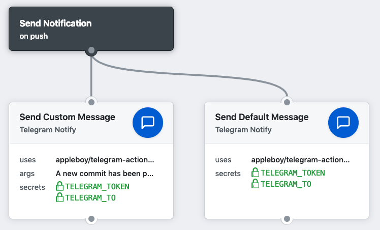

# 🚀 Telegram for GitHub Actions

[GitHub Action](https://developer.github.com/actions/) for sending a Telegram notification message.


## Usage

Send custom message and see the custom variable as blow.

```
action "Send Custom Message" {
  uses = "appleboy/telegram-action@master"
  secrets = [
    "TELEGRAM_TOKEN",
    "TELEGRAM_TO",
  ]
  args = "A new commit has been pushed. commit sha: {{ commit.sha }}"
}
```

Remove `args` to send the default message.

```
action "Send Default Message" {
  uses = "appleboy/telegram-action@master"
  secrets = [
    "TELEGRAM_TOKEN",
    "TELEGRAM_TO",
  ]
}
```



## Environment variables

* PHOTO - Optional. photo message
* DOCUMENT - Optional. document message
* STICKER - Optional. sticker message
* AUDIO - Optional. audio message
* VOICE - Optional. voice message
* LOCATION - Optional. location message
* VENUE - Optional. venue message
* VIDEO - Optional. video message
* DEBUG - Optional. enable debug mode
* FORMAT - Optional. `markdown` or `html`

### Example

```
action "Send photo message" {
  uses = "appleboy/telegram-action@master"
  secrets = [
    "TELEGRAM_TOKEN",
    "TELEGRAM_TO",
  ]
  env = {
    PHOTO = "tests/github.png"
  }
  args = "A new commit has been pushed."
}
```

## Secrets

Getting started with [Telegram Bot API](https://core.telegram.org/bots/api).

* `TELEGRAM_TOKEN`: Telegram authorization token.
* `TELEGRAM_TO`: Unique identifier for this chat.

How to get unique identifier from telegram api:

```
$ curl https://api.telegram.org/bot<token>/getUpdates
```

See the result: (get chat id like `65382999`)

```json
{
  "ok": true,
  "result": [
    {
      "update_id": 664568113,
      "message": {
        "message_id": 8423,
        "from": {
          "id": 65382999,
          "is_bot": false,
          "first_name": "Bo-Yi",
          "last_name": "Wu (appleboy)",
          "username": "appleboy46",
          "language_code": "en"
        },
        "chat": {
          "id": 65382999,
          "first_name": "Bo-Yi",
          "last_name": "Wu (appleboy)",
          "username": "appleboy46",
          "type": "private"
        },
        "date": 1550333434,
        "text": "?"
      }
    }
  ]
}
```

## Template variable

| Github Variable   | Telegram Template Variable |
|-------------------|----------------------------|
| GITHUB_REPOSITORY | repo                       |
| GITHUB_ACTOR      | repo.namespace             |
| GITHUB_SHA        | commit.sha                 |
| GITHUB_REF        | commit.ref                 |
| GITHUB_WORKFLOW   | github.workflow            |
| GITHUB_ACTION     | github.action              |
| GITHUB_EVENT_NAME | github.event.name          |
| GITHUB_EVENT_PATH | github.event.path          |
| GITHUB_WORKSPACE  | github.workspace           |
