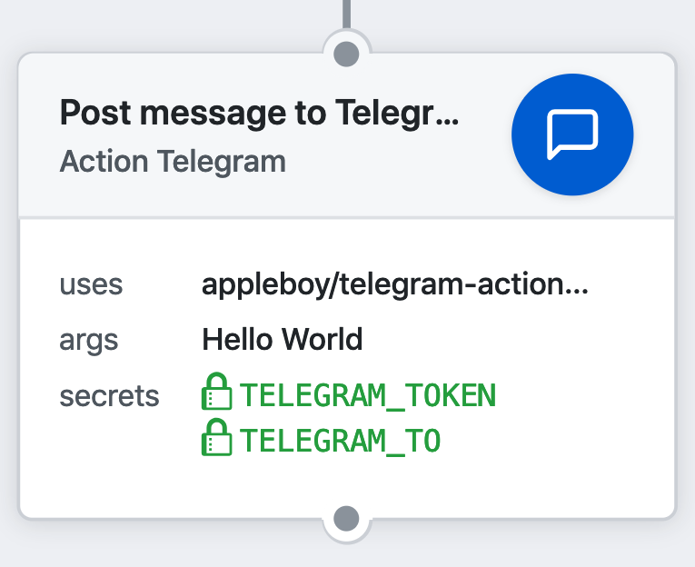

# 🚀 GitHub Actions 的 Telegram

[GitHub Action](https://github.com/features/actions) 用于发送 Telegram 通知消息。



[](https://github.com/appleboy/telegram-action/actions)

## 使用方法

**注意**：如果您收到 "Error: Chat not found" 错误，请参考这个 stackoverflow 的回答 [这里](https://stackoverflow.com/a/41291666)。

发送自定义消息并查看如下的自定义变量。

## 输入变量

| 变量                     | 描述                                                                                                    |
| ------------------------ | ------------------------------------------------------------------------------------------------------- |
| socks5                   | 可选。支持 socks5 代理 URL                                                                              |
| photo                    | 可选。照片消息                                                                                          |
| document                 | 可选。文档消息                                                                                          |
| sticker                  | 可选。贴纸消息                                                                                          |
| audio                    | 可选。音频消息                                                                                          |
| voice                    | 可选。语音消息                                                                                          |
| location                 | 可选。位置消息                                                                                          |
| venue                    | 可选。场馆消息                                                                                          |
| video                    | 可选。视频消息                                                                                          |
| debug                    | 可选。启用调试模式                                                                                      |
| format                   | 可选。`markdown` 或 `html`。参见 [MarkdownV2 样式](https://core.telegram.org/bots/api#markdownv2-style) |
| message                  | 可选。自定义消息                                                                                        |
| message_file             | 可选。用指定文件的内容覆盖默认消息模板。                                                                |
| disable_web_page_preview | 可选。禁用此消息中链接的预览。默认值为 `false`。                                                        |
| disable_notification     | 可选。禁用此消息的通知，支持发送无通知的消息。默认值为 `false`。                                        |

## 示例

发送照片消息：

```yml
- uses: actions/checkout@master
- name: send photo message
  uses: appleboy/telegram-action@master
  with:
    to: ${{ secrets.TELEGRAM_TO }}
    token: ${{ secrets.TELEGRAM_TOKEN }}
    message: send photo message
    photo: tests/github.png
    document: tests/gophercolor.png
```

发送位置消息：

```yml
- name: send location message
  uses: appleboy/telegram-action@master
  with:
    to: ${{ secrets.TELEGRAM_TO }}
    token: ${{ secrets.TELEGRAM_TOKEN }}
    location: '24.9163213 121.1424972'
    venue: '35.661777 139.704051 竹北體育館 新竹縣竹北市'
```

使用自定义代理发送消息（支持 `http`、`https` 和 `socks5`），如 `socks5://127.0.0.1:1080` 或 `http://222.124.154.19:23500`

```yml
- name: send message using socks5 proxy URL
  uses: appleboy/telegram-action@master
  with:
    to: ${{ secrets.TELEGRAM_TO }}
    token: ${{ secrets.TELEGRAM_TOKEN }}
    socks5: "http://222.124.154.19:23500"
    message: Send message from socks5 proxy URL.
```

## Secrets

开始使用 [Telegram Bot API](https://core.telegram.org/bots/api)。

* `token`: Telegram 授权令牌。
* `to`: 此聊天的唯一标识符。

如何从 Telegram API 获取唯一标识符：

```bash
curl https://api.telegram.org/bot<token>/getUpdates
```

查看结果：（获取聊天 ID，如 `65382999`）

```json
{
  "ok": true,
  "result": [
    {
      "update_id": 664568113,
      "message": {
        "message_id": 8423,
        "from": {
          "id": 65382999,
          "is_bot": false,
          "first_name": "Bo-Yi",
          "last_name": "Wu (appleboy)",
          "username": "appleboy46",
          "language_code": "en"
        },
        "chat": {
          "id": 65382999,
          "first_name": "Bo-Yi",
          "last_name": "Wu (appleboy)",
          "username": "appleboy46",
          "type": "private"
        },
        "date": 1550333434,
        "text": "?"
      }
    }
  ]
}
```

## 模板变量

| GitHub 变量       | Telegram 模板变量 |
| ----------------- | ----------------- |
| GITHUB_REPOSITORY | repo              |
| GITHUB_ACTOR      | repo.namespace    |
| GITHUB_SHA        | commit.sha        |
| GITHUB_REF        | commit.ref        |
| GITHUB_WORKFLOW   | github.workflow   |
| GITHUB_ACTION     | github.action     |
| GITHUB_EVENT_NAME | github.event.name |
| GITHUB_EVENT_PATH | github.event.path |
| GITHUB_WORKSPACE  | github.workspace  |
