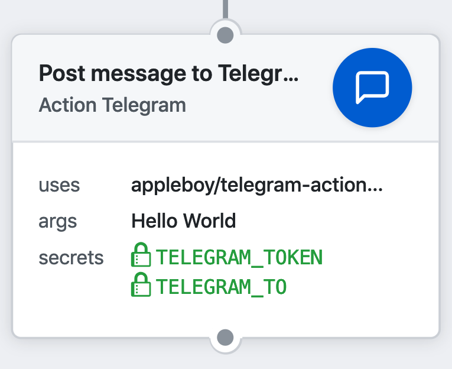
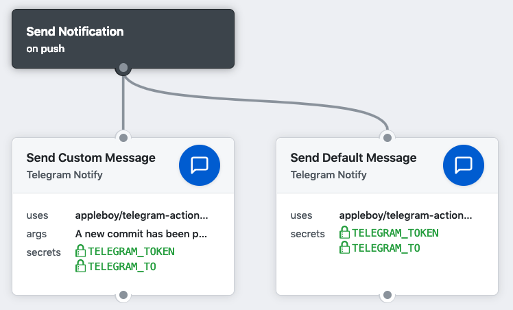

# 🚀 Telegram 的 GitHub Actions

[English](./README.md) | [简体中文](./README.zh-cn.md)

透過 [GitHub Action](https://github.com/features/actions) 發送 Telegram 通知訊息。



[](https://github.com/appleboy/telegram-action/actions)
[](https://github.com/appleboy/telegram-action/releases)
[](./LICENSE)

## 使用方式

在每次 push 時發送自訂訊息：

```yml
name: telegram message
on: [push]
jobs:

  build:
    name: Build
    runs-on: ubuntu-latest
    steps:
      - name: send telegram message on push
        uses: appleboy/telegram-action@v1
        with:
          to: ${{ secrets.TELEGRAM_TO }}
          token: ${{ secrets.TELEGRAM_TOKEN }}
          message: |
            ${{ github.actor }} created commit:
            Commit message: ${{ github.event.commits[0].message }}

            Repository: ${{ github.repository }}

            See changes: https://github.com/${{ github.repository }}/commit/${{github.sha}}
```

移除 `message` 參數則發送預設訊息，格式如下：

```text
appleboy/telegram-action/telegram message triggered by appleboy (push)
```



> `@v1` 會追蹤 `v1.x` 的最新版本。如需完全可重現的建置，請鎖定確切版本，
> 例如 `appleboy/telegram-action@v1.1.1`。

## 設定步驟

### 1. 建立 Telegram bot

在 Telegram 中與 [@BotFather](https://t.me/BotFather) 對話，輸入 `/newbot`
並依提示操作。BotFather 會回覆 bot token — 這就是 `TELEGRAM_TOKEN` secret。
詳見 [Telegram Bot API](https://core.telegram.org/bots/api)。

### 2. 取得 chat ID

先傳任意訊息給你的 bot（群組或頻道則需把 bot 加入成員並在其中發一則訊息），
然後呼叫：

```bash
curl https://api.telegram.org/bot<token>/getUpdates
```

從 `result[].message.chat.id` 讀取 chat ID — 這就是 `TELEGRAM_TO` secret。

- **私人對話**的 ID 是正數，例如 `65382999`。
- **群組 / 超級群組 / 頻道**的 ID 是負數，通常以 `-100` 開頭，例如
  `-1001234567890`。請使用數字 ID，不支援 `@channelname` 這類使用者名稱。
- 若 `getUpdates` 回傳空結果，請在聊天中重新發一則訊息後再呼叫一次。

**注意**：出現 "Error: Chat not found" 錯誤代表 chat ID 錯誤，或 bot 從未被
加入該聊天。亦可參考此 [StackOverflow 回答](https://stackoverflow.com/a/41291666)。

<details>
<summary><code>getUpdates</code> 回應範例</summary>

```json
{
  "ok": true,
  "result": [
    {
      "update_id": 664568113,
      "message": {
        "message_id": 8423,
        "from": {
          "id": 65382999,
          "is_bot": false,
          "first_name": "Bo-Yi",
          "last_name": "Wu (appleboy)",
          "username": "appleboy46",
          "language_code": "en"
        },
        "chat": {
          "id": 65382999,
          "first_name": "Bo-Yi",
          "last_name": "Wu (appleboy)",
          "username": "appleboy46",
          "type": "private"
        },
        "date": 1550333434,
        "text": "?"
      }
    }
  ]
}
```

</details>

### 3. 將 secrets 加入 repository

前往 repository 的 **Settings → Secrets and variables → Actions**，新增
`TELEGRAM_TOKEN` 與 `TELEGRAM_TO`。

## 輸入變數

| 變數                     | 說明                                                                                                    |
| ------------------------ | ------------------------------------------------------------------------------------------------------- |
| to                       | **必填**。目標聊天的 chat ID。以逗號分隔可發送到多個聊天，例如 `65382999,-1001234567890`                |
| token                    | **必填**。Telegram bot 授權 token                                                                       |
| message                  | 選填。自訂訊息，留空則發送預設訊息                                                                      |
| message_file             | 選填。使用指定檔案的內容覆蓋預設訊息模板，需搭配 `actions/checkout`                                     |
| message_thread_id        | 選填。論壇目標訊息串（主題）的唯一標識符，僅適用於論壇超級群組                                          |
| format                   | 選填。`markdown` 或 `html`，留空為純文字。參見下方[訊息格式](#訊息格式)                                 |
| photo                    | 選填。圖片檔案路徑，可逗號分隔多個並支援 glob 樣式，需搭配 `actions/checkout`                           |
| document                 | 選填。文件檔案路徑，可逗號分隔多個並支援 glob 樣式，需搭配 `actions/checkout`                           |
| sticker                  | 選填。貼圖檔案路徑，可逗號分隔多個並支援 glob 樣式，需搭配 `actions/checkout`                           |
| audio                    | 選填。音訊檔案路徑，可逗號分隔多個並支援 glob 樣式，需搭配 `actions/checkout`                           |
| voice                    | 選填。語音檔案路徑，可逗號分隔多個並支援 glob 樣式，需搭配 `actions/checkout`                           |
| video                    | 選填。影片檔案路徑，可逗號分隔多個並支援 glob 樣式，需搭配 `actions/checkout`                           |
| location                 | 選填。位置，格式為 `緯度 經度`，例如 `24.9163213 121.1424972`                                           |
| venue                    | 選填。地點，格式為 `緯度 經度 名稱 地址`                                                                |
| disable_web_page_preview | 選填。停用此訊息中連結的預覽。預設為 `false`                                                            |
| disable_notification     | 選填。靜音發送訊息（無通知音效）。預設為 `false`                                                        |
| socks5                   | 選填。自訂代理 URL（`http`、`https` 或 `socks5`）                                                       |
| debug                    | 選填。啟用除錯模式。預設為 `false`                                                                      |

## 範例

發送圖片與文件（檔案類參數需搭配 `actions/checkout`，檔案才會存在於
workspace 中）：

```yml
- uses: actions/checkout@v7
- name: send photo message
  uses: appleboy/telegram-action@v1
  with:
    to: ${{ secrets.TELEGRAM_TO }}
    token: ${{ secrets.TELEGRAM_TOKEN }}
    message: send photo message
    photo: tests/github.png
    document: tests/gophercolor.png
```

從檔案發送訊息：

```yml
- uses: actions/checkout@v7
- name: send message file
  uses: appleboy/telegram-action@v1
  with:
    to: ${{ secrets.TELEGRAM_TO }}
    token: ${{ secrets.TELEGRAM_TOKEN }}
    message_file: tests/message.txt
```

發送相同訊息到多個聊天：

```yml
- name: notify several chats
  uses: appleboy/telegram-action@v1
  with:
    to: "65382999,-1001234567890"
    token: ${{ secrets.TELEGRAM_TOKEN }}
    message: deploy finished
```

發送位置訊息：

```yml
- name: send location message
  uses: appleboy/telegram-action@v1
  with:
    to: ${{ secrets.TELEGRAM_TO }}
    token: ${{ secrets.TELEGRAM_TOKEN }}
    location: '24.9163213 121.1424972'
    venue: '35.661777 139.704051 竹北體育館 新竹縣竹北市'
```

發送訊息到特定論壇主題（訊息串）：

```yml
- name: send message to forum topic
  uses: appleboy/telegram-action@v1
  with:
    to: ${{ secrets.TELEGRAM_TO }}
    token: ${{ secrets.TELEGRAM_TOKEN }}
    message_thread_id: 42
    message: Hello from GitHub Actions!
```

使用自訂代理發送訊息（支援 `http`、`https` 和 `socks5`），如
`socks5://127.0.0.1:1080` 或 `http://222.124.154.19:23500`：

```yml
- name: send message using socks5 proxy URL
  uses: appleboy/telegram-action@v1
  with:
    to: ${{ secrets.TELEGRAM_TO }}
    token: ${{ secrets.TELEGRAM_TOKEN }}
    socks5: "http://222.124.154.19:23500"
    message: Send message from socks5 proxy URL.
```

## 訊息格式

使用 `format: markdown` 時，訊息會以 Telegram 的傳統
[Markdown 樣式](https://core.telegram.org/bots/api#markdown-style)發送。
底線會自動 escape，但未成對的 `*`、`` ` `` 或 `[` 字元（例如出現在 commit
訊息中）會讓 Telegram API 以 "can't parse entities" 錯誤拒絕整則訊息。
若訊息內容無法預期，建議改用 `format: html` 或純文字（不設定 `format`）。

## 模板變數

`message` 與 `message_file` 參數會以模板方式渲染：`{{ ... }}` 佔位符會被
替換為環境中的對應值。

```yml
- name: send message with template variables
  uses: appleboy/telegram-action@v1
  with:
    to: ${{ secrets.TELEGRAM_TO }}
    token: ${{ secrets.TELEGRAM_TOKEN }}
    message: |
      Commit {{ commit.sha }} on {{ commit.ref }}
      triggered by {{ repo.namespace }}
```

| GitHub 變數       | Telegram 模板變數 |
| ----------------- | ----------------- |
| GITHUB_REPOSITORY | repo              |
| GITHUB_ACTOR      | repo.namespace    |
| GITHUB_SHA        | commit.sha        |
| GITHUB_REF        | commit.ref        |
| GITHUB_WORKFLOW   | github.workflow   |
| GITHUB_ACTION     | github.action     |
| GITHUB_EVENT_NAME | github.event.name |
| GITHUB_EVENT_PATH | github.event.path |
| GITHUB_WORKSPACE  | github.workspace  |
